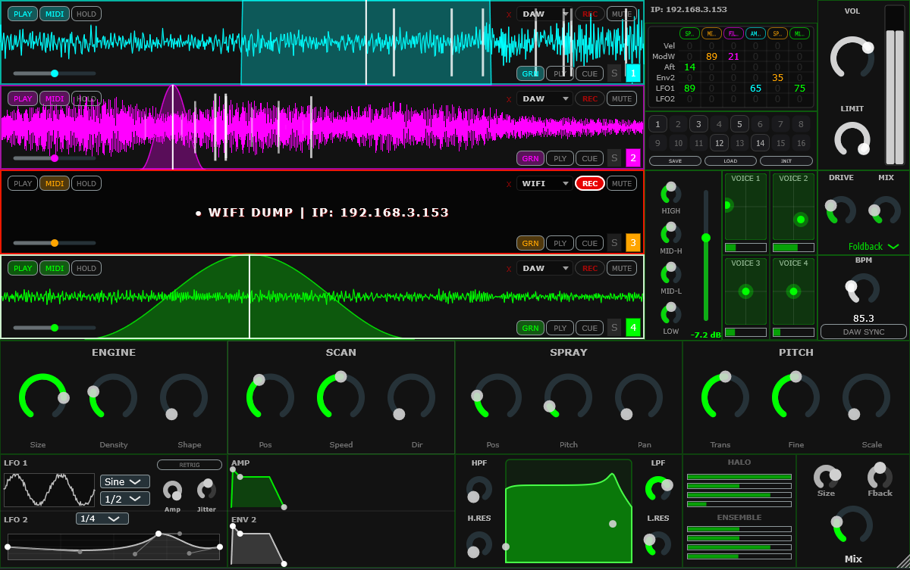
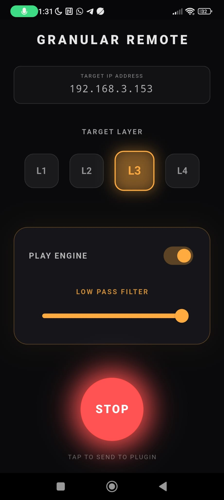

# Polyphonic Granular Synthesizer & OSC Remote

A high-performance, real-time 4-layer granular synthesizer plugin (VST3 / Standalone) built with **C++** and the **JUCE Framework**. It features a custom Digital Signal Processing (DSP) engine, a dynamic 6x6 modulation matrix, and seamless wireless integration with a companion **Flutter** mobile application via the Open Sound Control (OSC) protocol.

##  Plugin Interface

##  Key Features

* **4-Layer Granular Engine:** Four independent granular synthesizers, each with dedicated polyphony, supporting up to 128 simultaneous grains per voice. Features real-time control over grain size, density, shape, spray (position, pitch, pan), and scan speed.
* **Dynamic 6x6 Modulation Matrix:** A "Click-to-Map" routing system allowing users to map MIDI continuous controllers (Velocity, ModWheel, Aftertouch) and internal modulators (LFOs, Envelopes) to virtually any parameter in the synth.
* **Custom DSP Architecture:** * Zero-Delay Feedback (ZDF) State Variable TPT Filters (LPF/HPF).
  * 4-Voice "Monk" Formant Filter Bank for vocal-like textures.
  * Dual-Delay Pitch-Shifting Shimmer Reverb.
  * Multi-line Chorus/Ensemble effect.
  * 4-Band Parametric EQ and multi-algorithm Distortion (Soft Clip, Hard Clip, Foldback, Bitcrush).
* **Thread-Safe Memory Management:** Implements strict `juce::ScopedLock` mutexes separating the Audio Thread from the Message/UI Thread, ensuring zero audio dropouts (`std::bad_alloc` protection) during heavy real-time preset loading or audio buffer swapping.
* **Custom Binary Preset System:** Fast `.gsp` file serialization using `juce::ValueTree` to save and recall exact UI states, custom waveforms, and modulation routings.

##  Mobile OSC Remote (Flutter App)

The project includes a custom-built mobile application that acts as a wireless remote control for the synthesizer, communicating via TCP/IP and the OSC protocol.

  

* **Real-Time Synchronization:** Tap into the plugin's local IP address to control granular engines on the fly.
* **Layer Focus:** Quickly switch between Layer 1 to Layer 4 parameters straight from your smartphone.
* **Live Performance:** Ideal for live electronic music performances, allowing parameter tweaking without touching the DAW.

##  Technical Stack

* **Audio Plugin:** `C++17`, `JUCE Framework 7+`.
* **Mobile Application:** `Dart`, `Flutter`, `osc` package.
* **Networking:** `juce::OSCReceiver`, `juce::StreamingSocket` (TCP Audio Dumping).
* **Build System:** `Projucer` / `CMake`.

##  Build Instructions (Windows / macOS)

1. Clone the repository.
2. Open the `.jucer` file in the **Projucer**.
3. Ensure your global paths to the JUCE modules are correctly set.
4. Export the project to your preferred IDE (Visual Studio 2022 for Windows, Xcode for macOS).
5. **Important:** Always build the project in **Release** mode to ensure maximum DSP optimization and prevent CPU overloads during granular synthesis.
6. The compiled `Granular_Synth.vst3` will be located in the `Builds/[IDE]/x64/Release/VST3/` directory.

##  DSP Routing Scheme

The audio path is designed for maximum fidelity, utilizing a Crossover filter at 200Hz to preserve sub-bass frequencies while applying spatial and formant processing exclusively to the mid/high frequencies. 
All real-time modulation offsets are calculated using lambda functions applied directly to the parameters before rendering the audio block, ensuring optimal CPU utilization.

##  License

This project is for educational and portfolio purposes. 

---
*Developed as a comprehensive study in Advanced Audio DSP and Real-Time Systems Programming.*

https://github.com/JavierVillatoro/granular_remote 
