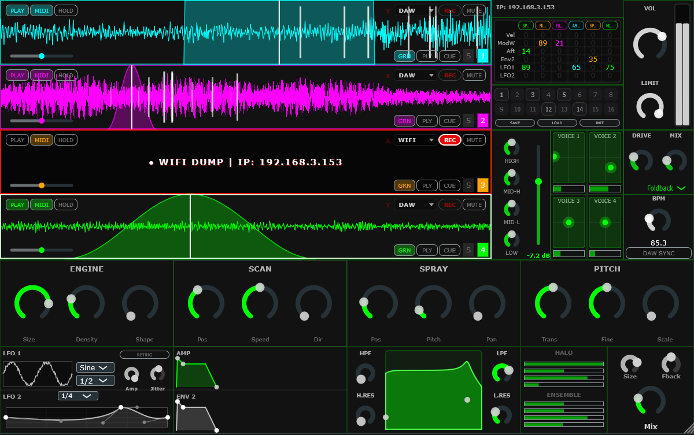
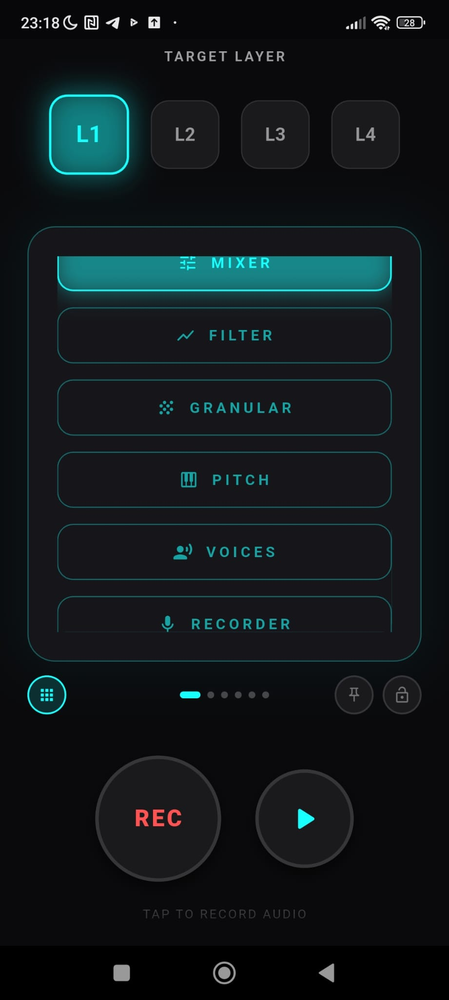
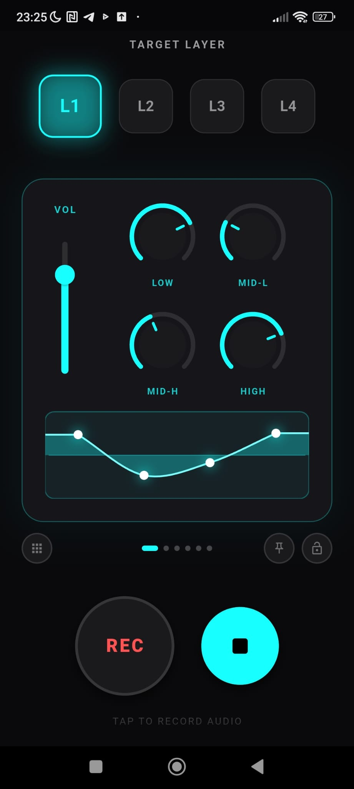
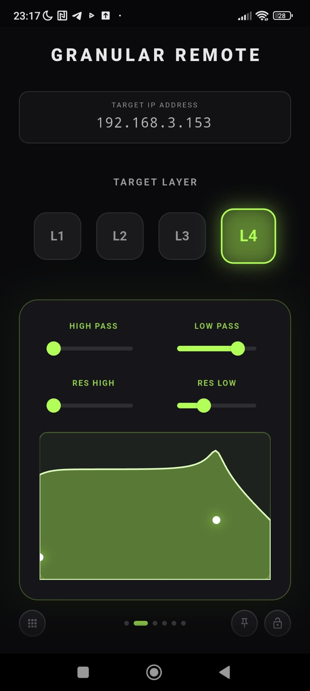
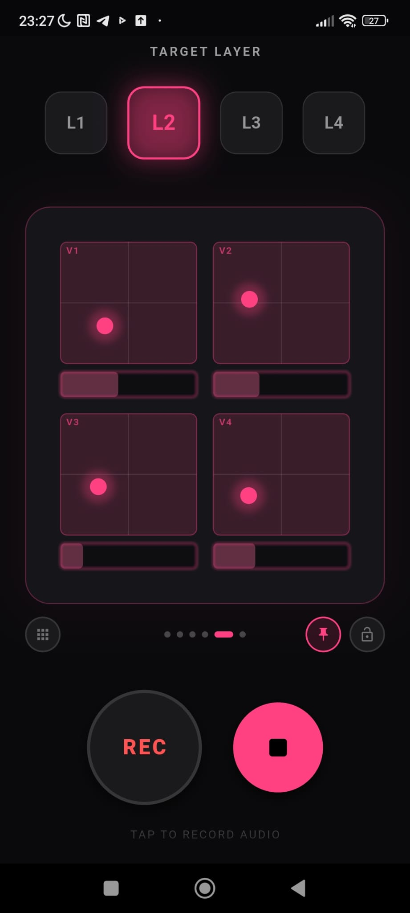
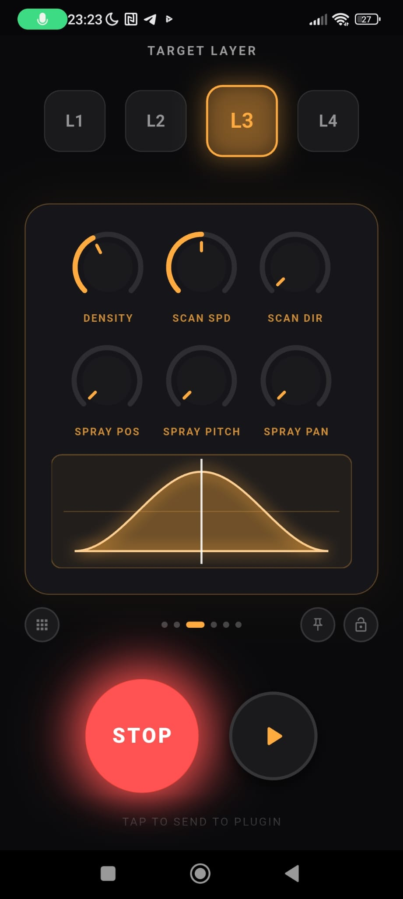
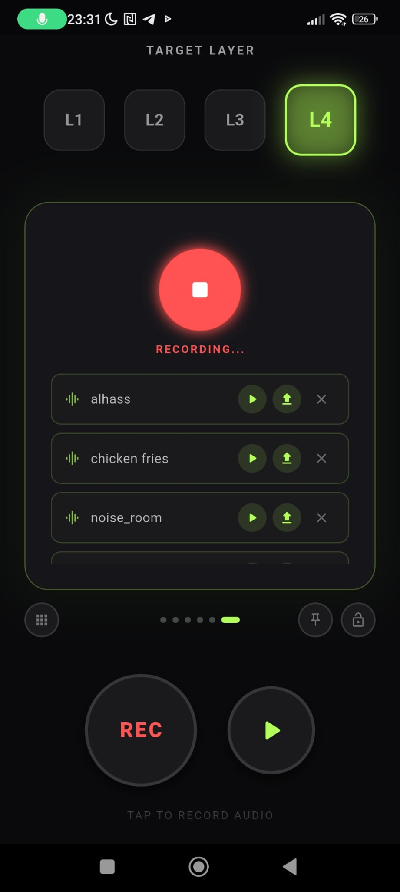

# Polyphonic Granular Synthesizer & OSC Remote

A high-performance, real-time 4-layer granular synthesizer plugin (VST3 / Standalone) built with **C++** and the **JUCE Framework**. It features a custom Digital Signal Processing (DSP) engine, a dynamic 6x6 modulation matrix, and seamless wireless integration with a companion **Flutter** mobile application via the Open Sound Control (OSC) protocol.

##  Plugin Interface

##  Key Features

* **4-Layer Granular Engine:** Four independent granular synthesizers, each with dedicated polyphony, supporting up to 128 simultaneous grains per voice. Features real-time control over grain size, density, shape, spray (position, pitch, pan), and scan speed.
* **Dynamic 6x6 Modulation Matrix:** A "Click-to-Map" routing system allowing users to map MIDI continuous controllers (Velocity, ModWheel, Aftertouch) and internal modulators (LFOs, Envelopes) to virtually any parameter in the synth.
* **Custom DSP Architecture:** * Zero-Delay Feedback (ZDF) State Variable TPT Filters (LPF/HPF).
  * 4-Voice "Monk" Formant Filter Bank for vocal-like textures.
  * Dual-Delay Pitch-Shifting Shimmer Reverb.
  * Multi-line Chorus/Ensemble effect.
  * 4-Band Parametric EQ and multi-algorithm Distortion (Soft Clip, Hard Clip, Foldback, Bitcrush).
* **Thread-Safe Memory Management:** Implements strict `juce::ScopedLock` mutexes separating the Audio Thread from the Message/UI Thread, ensuring zero audio dropouts (`std::bad_alloc` protection) during heavy real-time preset loading or audio buffer swapping.
* **Custom Binary Preset System:** Fast `.gsp` file serialization using `juce::ValueTree` to save and recall exact UI states, custom waveforms, and modulation routings.

##  Mobile OSC Remote (Flutter App)

The project includes a custom-built mobile application that acts as a wireless remote control for the synthesizer, communicating with the plugin over the local WiFi network via **OSC (UDP)** for real-time parameters and a lightweight **HTTP-over-TCP** channel for audio file transfer.

* **Real-Time Synchronization:** Enter the plugin's local IP address once and control every granular engine live, straight from your phone.
* **Per-Layer Engine Pages:** Each of the 4 layers (L1&#8211;L4) gets its own color (cyan / magenta / orange / lime) and its own independent state, so switching layers instantly restores exactly where you left every control.
* **Swipeable Module Menu:** A scrollable module picker (bottom-left button) lets you jump between 6 dedicated engine pages per layer &#8212; **Mixer, Filter, Granular, Pitch, Voices** and **Recorder** &#8212; each one redesigned to mirror the look and behaviour of its counterpart inside the plugin.
* **Lock & Pin controls:** A lock button freezes every knob while still allowing you to swipe between pages, and a pin button blocks page-swiping entirely for hands-free, one-page performance control.
* **Built-in Voice/Audio Recorder:** The **Recorder** page turns your phone into a portable sampler &#8212; record audio anywhere (voice, room tone, field recordings...), name and keep the clips in a local library, preview them, and send any of them **directly to any layer of the plugin over WiFi**, with no cable, no DAW routing, and no USB transfer required.
* **Planned:** Effects modules (Reverb, Distortion and more) already exist in the plugin's DSP chain and are next in line to get their own remote page, alongside Envelope/LFO/Matrix controls.

<table align="center">
<tr>
<td align="center" width="33%">
   
  <b>Module menu</b> Scrollable picker for the 6 engine pages: Mixer, Filter, Granular, Pitch, Voices, Recorder.
</td>
<td align="center" width="33%">
   
  <b>Mixer (L1, cyan)</b> Volume fader plus a 4-band EQ (Low / Mid-L / Mid-H / High) with a live EQ curve, mirroring the plugin's mixer module.
</td>
<td align="center" width="33%">
   
  <b>Filter (L4, lime)</b> High-Pass / Low-Pass cutoff and resonance sliders, drawing the same filter curve shown in the plugin's Filter module.
</td>
</tr>
<tr>
<td align="center" width="33%">
   
  <b>Voices (L2, magenta)</b> 4 independent XY pads (V1&#8211;V4) with mix bars, for the formant/"Monk" voice engine.
</td>
<td align="center" width="33%">
   
  <b>Recording in the background (L3, orange)</b> Recording (top status-bar mic icon) keeps running no matter which engine page you're browsing &#8212; here, voice is being captured for Layer 3 while viewing the Granular/Spray page.
</td>
<td align="center" width="33%">
   
  <b>Recorder library (L4, lime)</b> Every take is saved locally with its own name; play it back, or send it straight to the target layer over WiFi.
</td>
</tr>
</table>

##  Technical Stack

* **Audio Plugin:** `C++17`, `JUCE Framework 7+`.
* **Mobile Application:** `Dart`, `Flutter`, `osc` package.
* **Networking:** `juce::OSCReceiver`, `juce::StreamingSocket` (TCP Audio Dumping).
* **Build System:** `Projucer` / `CMake`.

##  Build Instructions (Windows / macOS)

1. Clone the repository.
2. Open the `.jucer` file in the **Projucer**.
3. Ensure your global paths to the JUCE modules are correctly set.
4. Export the project to your preferred IDE (Visual Studio 2022 for Windows, Xcode for macOS).
5. **Important:** Always build the project in **Release** mode to ensure maximum DSP optimization and prevent CPU overloads during granular synthesis.
6. The compiled `Granular_Synth.vst3` will be located in the `Builds/[IDE]/x64/Release/VST3/` directory.

##  DSP Routing Scheme

The audio path is designed for maximum fidelity, utilizing a Crossover filter at 200Hz to preserve sub-bass frequencies while applying spatial and formant processing exclusively to the mid/high frequencies. 
All real-time modulation offsets are calculated using lambda functions applied directly to the parameters before rendering the audio block, ensuring optimal CPU utilization.

##  License

This project is for educational and portfolio purposes. 

---
*Developed as a comprehensive study in Advanced Audio DSP and Real-Time Systems Programming.*

https://github.com/JavierVillatoro/granular_remote 
